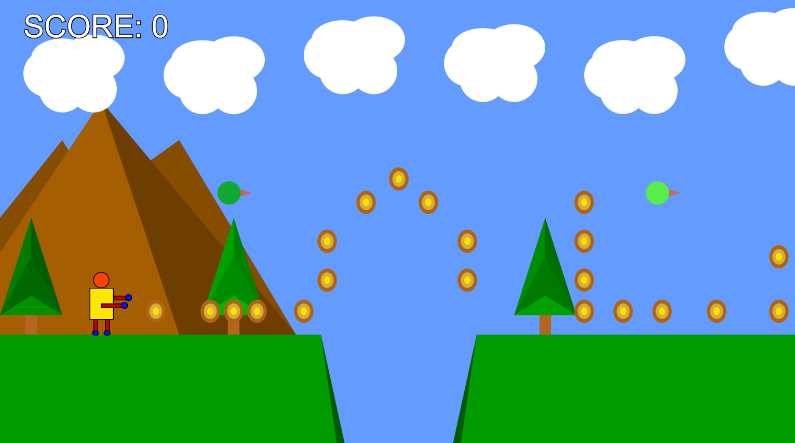
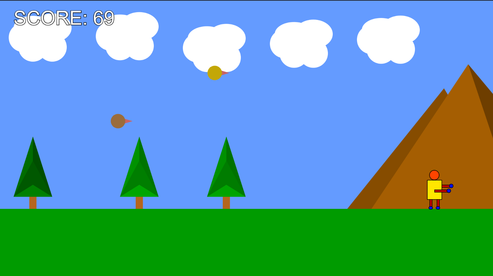

### [didactic waddle](https://didactic-waddle.netlify.app) ###
author: @shameekbaranwal

A simple 2D game project using p5.js framework with a character traversing a two-dimensional world full of background elements like clouds and trees. The player can use the `left` and `right arrow keys` to control the horizontal motion of the character, and the `spacebar` to make it jump. Upon reaching the end of the visible world, the background will begin to scroll, giving the illusion of further motion.

The objective of every level is to travel from the first mountain to the second, while collecting as many coins along the way as possible. The player must avoid the hitting the birds or falling into the canyons, as the game will end and he will need to restart.

You can check out the latest release [`here`](https://didactic-waddle.netlify.app)